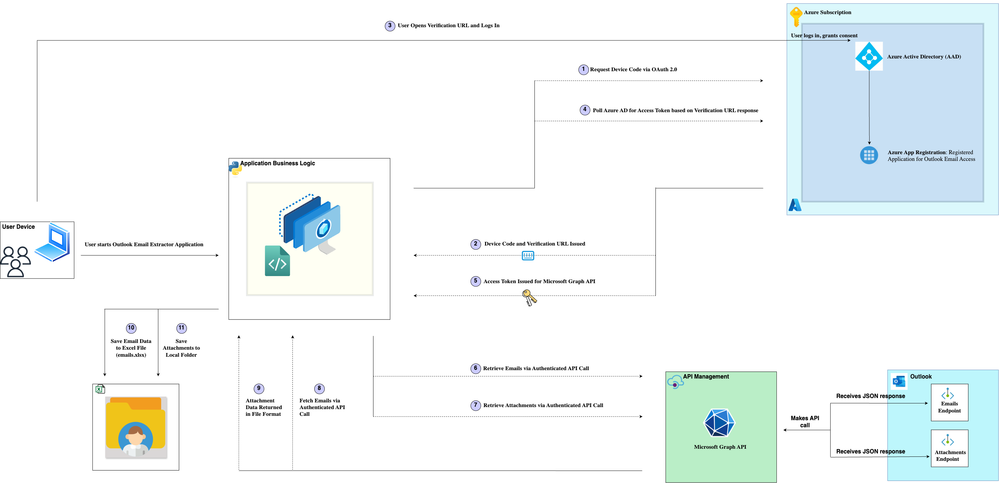

# Outlook Business Insights Extractor

## Overview

**Outlook Business Insights Extractor** is a Python-based tool that automates the process of accessing, extracting, and processing emails from Microsoft Outlook using the Microsoft Graph API. The extracted data includes metadata (e.g., sender, recipients, subject), email content, and attachments. The tool saves the processed data in an organized Excel file, offering valuable insights for business analysis and reporting.

This project is designed to streamline email processing for professionals and businesses who rely on Outlook for communication and need automated solutions to extract actionable insights.

---

## Features

- **OAuth 2.0 Device Flow Authentication**: Securely authenticate with Azure Active Directory.
- **Automated Email Extraction**:
  - Retrieve email metadata (subject, sender, recipients, date, etc.).
  - Extract email content in plain text or HTML.
- **Attachment Handling**:
  - Download and save attachments locally.
- **Data Export to Excel**: Save structured email data in a customizable Excel format.
- **Error Logging**: Track issues and events through detailed log files.

---

## Architecture Diagram

The architecture below outlines the flow of the application, including authentication, API interactions, and local data processing:



### **Architecture Components**

1. **User Device**:
   - The application is executed on the user's device.
   - The user initiates the process by running the Python script.

2. **Azure Active Directory (AAD)**:
   - Manages authentication using OAuth 2.0 Device Code Flow.
   - Issues a device code and verification URL for user authentication.
   - Grants an access token upon successful authentication and consent.

3. **Azure App Registration**:
   - Configures the application in Azure AD.
   - Defines permissions (`Mail.Read`, `User.Read`) required to access Outlook data via Microsoft Graph API.

4. **Microsoft Graph API**:
   - **Emails Endpoint (`/me/messages`)**: Retrieves email metadata and content.
   - **Attachments Endpoint (`/attachments`)**: Fetches email attachments.

5. **Local Storage**:
   - **Excel File (`emails.xlsx`)**: Contains structured email data.
   - **Attachments Folder**: Stores downloaded email attachments.

### **Data Flow**

1. **Authentication**:
   - The application sends a device code request to Azure AD.
   - The user logs in using the verification URL and enters the provided code.
   - Azure AD issues an access token upon successful authentication.

2. **API Requests**:
   - The application uses the access token to query the Microsoft Graph API for emails and attachments.

3. **Data Processing and Storage**:
   - Emails are parsed, and metadata/content is stored in an Excel file.
   - Attachments are downloaded to a local directory.

---

## Setup Instructions

### 1. Create an Azure AD Application

#### a. Register the Application

1. Go to [Azure Portal](https://portal.azure.com/) and log in.
2. Navigate to **Azure Active Directory > App Registrations**.
3. Click **New Registration**.
4. Provide a name (e.g., "Outlook Business Insights Extractor").
5. Select **Accounts in any organizational directory and personal Microsoft accounts**.
6. Add **Redirect URI**: https://login.microsoftonline.com/common/oauth2/nativeclient
7. Click **Register**.

#### b. Configure API Permissions

1. Go to the **API Permissions** tab.
2. Click **Add a Permission > Microsoft Graph > Delegated Permissions**.
3. Add the following:
- `Mail.Read`
- `User.Read`
- `File.Read`
- `File.Read.All`

4. Click **Grant Admin Consent** to approve the permissions.

#### c. Note the Credentials

1. Copy the **Application (client) ID** and **Directory (tenant) ID**.
2. Enable **"Allow public client flows"** under **Authentication**.

---

### 2. Configure the Application

#### a. Create a `.env` File

1. Create a `.env` file in the project root directory.
2. Add the following Azure credentials:
   ```env
   CLIENT_ID=your-client-id
   TENANT_ID=your-tenant-id
   ```

---

#### b. Install Dependencies

1. Create a virtual environment:
   ```bash
   python3 -m venv env
   ```

2. Activate the virtual environment:
   - On macOS/Linux:
     ```bash
     source env/bin/activate
     ```
   - On Windows:
     ```bash
     .\env\Scripts\activate
     ```

3. Install the required packages:
   ```bash
   pip install -r requirements.txt
   ```

4. Verify the installation:
   ```bash
   pip list
   ```

---

### Usage

1. Run the application:
   ```bash
   python main.py
   ```

2. Follow the on-screen instructions:
   - Open the provided verification URL in your browser.
   - Enter the device code displayed in the terminal.
   - Log in to your Microsoft account and approve permissions.

3. View output:
   - Processed email data will be saved in the `output/emails.xlsx` file.
   - Attachments will be saved in the `data/attachments/` folder.

---

### Project Structure

```
outlook-business-insights-extractor/
├── data/
│   └── attachments/
├── env/
├── logs/
├── output/
│   └── emails.xlsx
├── utils/
│   ├── __init__.py
│   ├── email_processor.py
│   ├── graph_api.py
│   ├── logger.py
├── config.py
├── main.py
├── requirements.txt
├── Architecture-Diagram.png
├── .gitignore
├── README.md
```

---

### Key Components

1. **`main.py`**: Orchestrates authentication, API calls, and data processing.
2. **`config.py`**: Stores configuration settings.
3. **`utils/graph_api.py`**: Handles API requests.
4. **`utils/email_processor.py`**: Processes email data.
5. **`utils/logger.py`**: Manages logging for error tracking.

---

### API Endpoints Used

1. **Emails Endpoint**:
   - **URL**: `https://graph.microsoft.com/v1.0/me/messages`
   - **Purpose**: Retrieve email metadata and content.

2. **Attachments Endpoint**:
   - **URL**: `https://graph.microsoft.com/v1.0/me/messages/{message-id}/attachments`
   - **Purpose**: Fetch attachments for specific emails.

---

### Output Format

1. **Excel File (`emails.xlsx`)**:
   - **Columns**:
     - Sender
     - Recipients
     - Subject
     - Date
     - Body Preview
   - **Location**: `output/emails.xlsx`

2. **Attachments**:
   - **File Format**: Original file format.
   - **Location**: `data/attachments/`

---

### Troubleshooting

#### Common Errors

1. **Invalid Authentication Token**:
   - **Error**: `InvalidAuthenticationToken`
   - **Solution**: Re-authenticate by restarting the application.

2. **Insufficient Permissions**:
   - **Error**: `Access Denied`
   - **Solution**: Ensure the Azure App has the correct permissions (`Mail.Read`, `User.Read`) and that admin consent is granted.

3. **API Rate Limits**:
   - **Solution**: Implement retry logic or reduce the number of requests per second.

---

### Contributing

1. Fork the repository.
2. Create a branch.
3. Submit a pull request.

---

### License

MIT License.

---

### Acknowledgments

- Microsoft Graph API.
- Azure AD.
